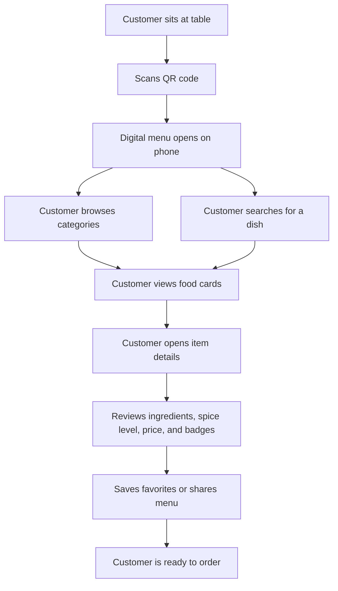
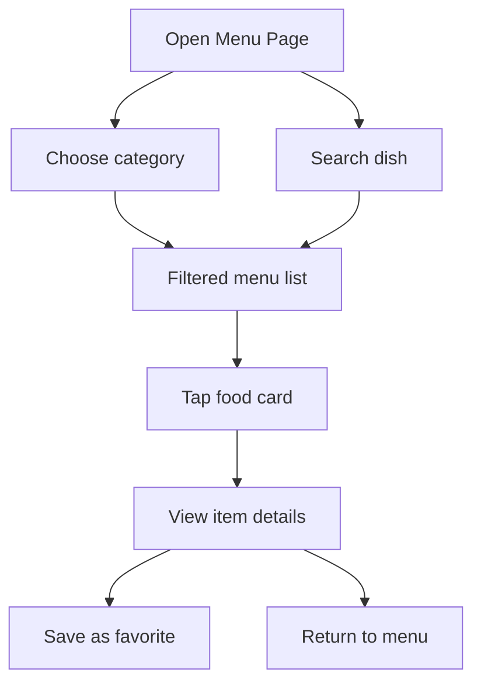
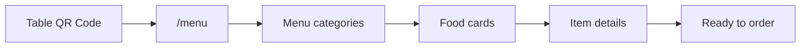
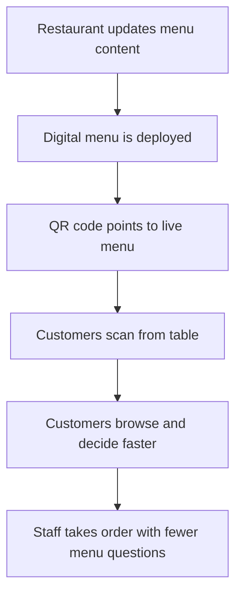

# The Crust Culture

## Digital Menu Prospectus

The Crust Culture is a premium QR-based digital menu experience designed for restaurant guests. A customer scans a QR code placed on the table and instantly opens a polished, mobile-friendly menu on their phone.

The goal is simple: make menu browsing faster, cleaner, more attractive, and easier to use than a printed menu.

## What Customers Experience

Customers do not need to install an app or create an account. They scan, browse, search, view dish details, save favorites, and contact the restaurant directly from the menu.

The experience is built around mobile phones first, especially 375px-wide devices commonly used by guests at restaurant tables.

## Key Highlights

- Instant QR access to the menu
- Premium dark restaurant design
- Smooth animated splash screen
- Large touch-friendly controls
- Sticky category navigation
- Searchable menu items
- Food cards with images, prices, descriptions, badges, and veg/non-veg indicators
- Detailed item popup with ingredients and spice level
- Favorites for guests to shortlist dishes
- Share menu option
- Floating call button
- Dark/light mode
- Smooth scroll and page animations

## Customer Journey



## Restaurant Value

The Crust Culture digital menu helps the restaurant present its food in a premium, modern format while reducing dependency on printed menus.

For the restaurant, this creates:

- A cleaner table experience
- Faster access to menu information
- Better presentation of popular and best-selling dishes
- Easier highlighting of today's specials
- Reduced printing and replacement cost
- A more modern brand impression
- Better mobile engagement for dine-in customers

## Main Screens

### Splash Screen

The first screen introduces the restaurant with an animated logo and welcome message. After a short delay, customers are taken directly to the menu.

### Home Page

The home page presents the restaurant brand, today's special, popular categories, and featured dishes. It is useful for customers who want a broader introduction to the restaurant.

### Menu Page

The menu page is the main QR destination. Customers can browse all categories, search items, open food details, save favorites, and share the menu.

Menu categories include:

- Pizza
- Burgers
- Pasta
- Sandwiches
- Starters
- Desserts
- Beverages

### Item Details

Each item can be opened in a detailed popup showing the food image, description, ingredients, price, spice level, best-seller badge, and veg/non-veg information.

### About Page

The about page tells the restaurant story and shows opening hours, contact details, restaurant imagery, and a location map placeholder.

### Contact Page

The contact page gives customers quick access to phone, email, address, and social media links.

## Menu Browsing Flow



## QR Table Flow



## Guest Features

| Feature | Benefit |
| --- | --- |
| Category tabs | Guests quickly jump to Pizza, Burgers, Pasta, Desserts, and more |
| Search bar | Guests can instantly find a dish |
| Food images | Items feel more attractive and easier to choose |
| Popular badge | Highlights customer favorites |
| Best-seller badge | Guides guests toward signature dishes |
| Veg/non-veg indicator | Makes dietary identification fast |
| Spice level | Helps customers choose comfortably |
| Favorites | Lets guests shortlist dishes before ordering |
| Share menu | Customers can share the menu with others |
| Floating call button | Quick restaurant contact from any page |

## Brand Feel

The design uses a premium restaurant style:

- Dark background
- Warm orange highlights
- Gold accents
- Cream call-to-action buttons
- Elegant serif headings
- Smooth animations
- Modern food cards
- Mobile-first spacing

The visual direction is intended to feel refined, warm, and suitable for a modern casual dining restaurant.

## Suggested QR Usage

Place QR codes on:

- Dining tables
- Counter displays
- Takeaway bags
- Table tents
- Printed bills
- Social media posts

Recommended QR destination:

```text
https://your-domain.com/menu
```

Alternative QR destination:

```text
https://your-domain.com/qr
```

The `/qr` route redirects customers to the main menu page.

## Content Included

The current menu contains 30 sample dishes across 7 categories. Each item includes:

- Dish name
- Category
- Description
- Price
- Food image
- Veg/non-veg status
- Popular flag
- Best-seller flag
- Spice level
- Ingredients

## Operational Flow



## Ideal For

This menu experience is suitable for:

- Restaurants
- Cafes
- Pizzerias
- Burger outlets
- Cloud kitchen dine-in counters
- Food courts
- Premium casual dining spaces
- Hotel restaurants

## Technical Summary

The application is built as a modern web app using:

- React.js
- Vite
- React Router
- Tailwind CSS
- GSAP
- Swiper
- React Icons

It can be hosted as a static website and opened directly from a QR code.

## Local Preview

Install dependencies:

```bash
npm install
```

Start the local server:

```bash
npm run dev
```

Build for production:

```bash
npm run build
```

Run code checks:

```bash
npm run lint
```

## Deployment Note

After deployment, connect the restaurant QR code to the live menu URL. For best results, use the direct menu route:

```text
/menu
```

For single-page app hosting, configure all unknown routes to load `index.html`.
